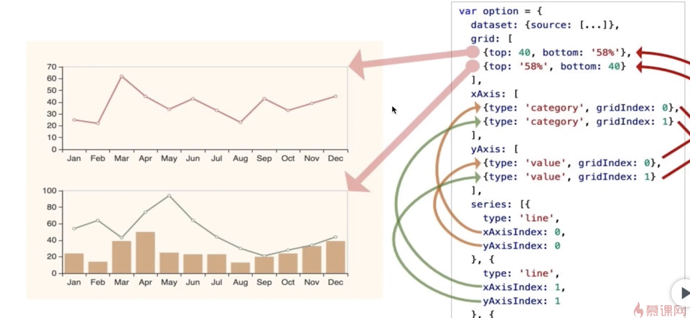
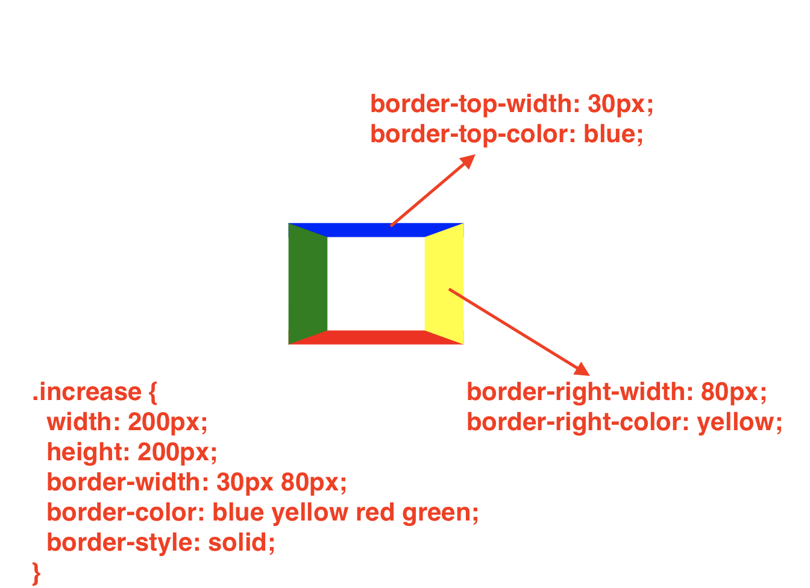

# data-visualization
charts
[TOC]
## 构建组件库 - `rolloup`
#### 构建 Vue 组件库需要的插件
```js
const resolve = require('rollup-plugin-node-resolve')  // 为了支持 vue, react
const commonjs = require('rollup-plugin-commonjs')  // 支持 CommonJs
const babel = require('rollup-plugin-babel')  // 版本编译，es6 - es5等等
const json = require('@rollup/plugin-json')  // 识别 json 文件
const vue = require('rollup-plugin-vue')    // 识别 vue 文件
const postcss = require('rollup-plugin-postcss') // 支持识别 css, sass等
```
<br/>

#### 配置
* npm 打包`script`
  ```json
  "scripts": {
    "dev": "rollup -wc rollup.config.dev.js",
    "build": "eslint ./src & rollup -c rollup.config.dev.js",
    "build:prod": "eslint ./src & rollup -c rollup.config.prod.js",
    "lint": "eslint ./src",
    "test": "echo \"Error: no test specified\" && exit 1"
  },
  ```
    * w - 监听，可视热启动
    * c - 创建
* **安装 `Eslint` - 否则真实项目中引用时候会报错**
  * `npm i -D esllint`
  * 执行 `./node_modules/.bin/eslint --init`
  * 修改 `.eslintrc.js` 文件 - 配置相关规则
* **导出模块化的标准**
  * umd - 输出的模块 - JS的函数
  * cjs(commonJS - node 模块的标准) - 输出的模块 - module.exports
    * 需要 webpack 进行打包 - umd 模块，因为找不到 `windows.module`
  * es - 输出的模块 - export default
    * 加入 `type=modlue`即可，`<script type="module">`
* **tree-shaking**
  * 去掉一些不必要的引入
  * ES6 - 不需要整体导出的时候，尽量采用挨个导出
    ```js
    export const a = 1;
    export const b = 2;
    import { a } from '..'

    // 而不是采用
    const a = 1;
    const b = 2;
    export default {a, b}
    import * as data from '..'
    ```
  * CommonJS
    ```js
    exports.a = 1;
    exports.b = 2;
    import { a } from '..'

    // 而不是采用
    const a = 1;
    const b = 2;
    module.exports = {a, b}
    import {a, b} from '..'
    ```
#### 插件
* rollup-plugin-commonjs
  * rollup 默认`es6`模块打包，不支持 `CommonJs` 模块
  * 需要为`CommonJs`打包，可以使用插件，否则会报错: `Error: 'default' is not exported by ...`
    * `npm install -D rollup-plugin-commonjs`

* rollup-plugin-node-resolve
  * 为了支持 `vue`，需要的一些插件
  * `npm install -D rollup-plugin-node-resolve`
    * 将代码中依赖的三方库中的内容一起混合打包（缺点打包后的文件有冗余，且体积变得），如果没有这个插件，打包后会报错: 找不到依赖的库
  * `external`属性可以解决上述问题，依然将三方库作为一个依赖，但不打包到文件中

* rollup-plugin-babel
  * 版本编译 - babel
  * 主要作用将 es6 的代码转换成之前的代码
    * 比如 es6 的箭头函数，有些浏览器是不支持的，需要转换为`function`样式
    * rollup - 使用插件`npm install -D rollup-plugin-babel`

* @rollup/plugin-json
  * rollup打包不识别`json`，报错：`Error: Unexpected token (Note...json)`
    * 安装 `json`插件 - `npm install -D @rollup/plugin-json`

* `terser` - 压缩
  * 安装 - `npm install -D rollup-plugin-terser`

#### `rollup 中解决 babel问题`
* Error: `regeneratorRuntime`报错
  * 未支持`async function`
  * **`rollup - 2.16.1`还未支持 async 函数， 但是`2.66.1`已经支持了**
* rollup 中添加 async-await函数 (`<= 2.16.1`)
  * `babel/plugin-transform-runtime`
    * [安装](https://www.npmjs.com/package/babel-plugin-transform-runtime)
    * [文档](https://babeljs.io/docs/en/babel-plugin-transform-runtime#:~:text=The%20transform-runtime%20transformer%20plugin%20does%20three%20things%3A%20Automatically,module%20%40babel%2Fruntime%2Fhelpers%20instead%20%28toggleable%20with%20the%20helpers%20option%29.)
  ```sh
  npm i --save-dev @babel/plugin-transform-runtime

  # Enter into xx/rollup.config.dev.js
  babel({
    // ...,
    runtimeHelpers: true,
    plugins: [
      '@babel/plugin-transform-runtime', {
        regenerator: true
      }
    ]
  })

  # 生产环境下进行同步配置 xx/rollup.config.prod.js
  ```
#### 封装 vue 组件库
* 创建 Vue 文件
* 入口文件中引入
  ```js
  import Test2 from './Test2.vue'

  export default function(Vue) {
    Vue.component(Test2.name, Test2)
  }
  ```
* 打包
  * Error
    * Error: Unexpected token (Note that you need plugins to import files (*.vue) that are not JavaScript)
      * `npm i -D rollup-plugin-vue`
    * (plugin commonjs) SyntaxError: Unexpected token (2:2) in /Users/apple/data-visualization/datav-screen-dev-lib/src/Test.vue?vue&type=template&id=07bdddea&lang.js
      * `npm i -D rollup-plugin-postcss`
    * (plugin commonjs) SyntaxError: Unexpected token (2:2) in C:\Users\admin\Desktop\ts\ruleup\src\test.vue?vue&type=template&id=0f72a62a&lang.js
      * **可能是 plugin 的顺序有问题，将 vue() 放在最前面**
    * (plugin postcss) Error: You need to install one of the following packages: "sass", "node-sass" in order to process SASS files
      * `npm i -D sass`
    * Missing global variable name
      * 在 `output`中添加
        ```json
        globals: {
          vue: 'vue'
        }
        ```
#### 引用封装的组件库
* **html 中引用**
  * 在 `<script>` 中引入 vue 框架库
  * 在 `<script>` 中引入 打包好的文件
    ```js
    <script src="https://cdn.jsdelivr.net/npm/vue@3.1.0/dist/vue.global.prod.js"></script>
    <script src="../dist/datav.js"></script>

    <body>
        <div id="app">
            {{message}}
            <test-component></test-component>
        </div>
        <script>
            Vue.createApp({
                setup() {
                    var message = 'Hello world'
                    return {
                        message
                    }
                }
            }).use(window.datavDevLib).mount('#app')
        </script>
    </body>
    ```
* **vue 项目中引用**
  * **上传至 npm 引用**
  <br/>
  * 本地引用(**如果是热打包是可以动态调试的**) - `npm link`
    * 修改入口路径 - `package.json` - `main` - 指向打包后文件
    * 添加 `files` 属性 - 指定上传 npm 包含哪些文件
      ```json
      // package.json
      "files": [
        "dist",
        "src"
      ]
      ```
    * 执行 `npm link` - 本地做一个映射
      * 如果报错 - 删除 `node_modules`后重新 link
    * **进入真实的 vue 项目中**
      * 在 `package.json`中手动添加依赖
        * `datav-screen-lib-dev: "1.0.0"`
      * 执行 `npm link datav-screen-lib-dev` - 过一会儿，就会在 `node_modules`中引入对应组件库
      * 在`main.js`中引入组件
        ```js
        import datav from 'datav-screen-dev-lib'

        createApp(App).use(store).use(router).use(datav).mount('#app')

        // .vue 文件中
        <div>
          // 引用定义的组件
        </div>
        ```
      * **按需加载(减少包的体积)** - 类似于直接加载每一个组件源码
        * 需要 `npm install -D babel-plugin-component` 插件的支持
        * [插件安装参考 elementUI](https://element.eleme.cn/#/en-US/component/quickstart)
        * 如果使用`vue-cli`创建的项目，默认已经配置好了
          * 使用
            ```js
            import Test1 from 'datav-screen-dev-lib/src/components/Test1/index'

            createApp(App).use(store).use(router).use(Test1).mount('#app')
            ```
#### Vue3, Vue2 组件库兼容问题
* Vue3 封装的组件库是无法在 Vue2 项目中使用的
  * 修改 Vue3 组件库
    * 降低 `"rollup-plugin-vue": "^5.0.0"` 版本
    * 安装 `npm i -D vue-template-compiler`
    * 修改 vue 文件，替换掉一些 vue2 不支持的语法
* 值得注意的是，反过来是可以的 Vue2 组件库可以在 vue3 中使用
  * 但是一些 Vue3 的语法就没办法使用，比如： tree-shaking
  * 一些 vue3 废弃得语法也无法使用，比如: vue2 的 `filter功能`
* **建议**
  * Vue3 的项目还是使用 vue3 进行组件库开发
  * Vue2 的项目使用 vue2 进行组件库开发

***********************
# 数据可视化解决方案
## 常见的有
* 第一梯队
  * HighCharts
  * Echarts
  * AntV
* 相对更底层一点
  * **three.js**
    * 主要用于`3D`绘制
    * **其是一个基于`WebGL`的`JavaScript 3D`图形库**
  * **zrender**
    * 其是一个二维绘图引擎，提供`canvas, SVG, VML`等多种渲染方式
    * **对`canvas`进行底层封装，是`Echarts`的渲染器**
  * **d3**
    * 主要用于矢量图绘制
    * 其是一个`JavaScript`图形库，基于`Canvas, Svg, HTML`
    * **工作方式是，拿到数据后去更新`DOM`的方式**
* 更进一步 (浏览器提供的一些底层框架)
  * **Canvas**
    *  HTML5的新特性， 其是一张画布，允许通过`JavaScript`绘制图形
    * 绘制的图形不是 `DOM` 元素，无法选中或者修改`DOM`元素去修改属性
  * **Svg**
    * 基于`XML`的图像文件格式
    * **更适合于需要缩放的图形 - 比如图标**
    * **劣势**
      * 开销比`Canvas`要大，尤其是动画场景
  * **WebGL**
    * 其是一种`3D`绘图协议，可以为`HTML5 的 Canvas`提供硬件`3D`加速渲染
    * 使得`Web`开发人员**可以借助系统显卡在浏览器中流畅地展示 3D 场景和模型**
  * **HTML**
* 再下面就是 - Chrome
* Chrome 下面就是
  * **Skia**
    * Chrome 和 Android 底层`2D`绘图引擎
  * **OpenGL**
    * Open Graphics Library - 跨平台
    * `2D, 3D`图形渲染库
  * **note: 一般使用 C++ 直接和硬件进行通讯**
## Canvas
* HTML5的新特性， 其是一张画布，允许通过`JavaScript`绘制图形
* 绘制的图形不是 `DOM` 元素，无法选中或者修改`DOM`元素去修改属性
## SVG (Scalable Vector Graphics) - 可缩放的矢量图形
* 基于`XML`的图像文件格式
* 更适合于需要缩放的图形 - 比如图标
* 劣势
  * 开销比`Canvas`要大，尤其是动画场景
## WebGL(Web Graphocs Library)
* 其是一种`3D`绘图协议，可以为`HTML5 的 Canvas`提供硬件`3D`加速渲染，从而使得`Web`开发人员**可以借助系统显卡在浏览器中流畅地展示 3D 场景和模型**
## Zrender
* 其是一个二维绘图引擎，提供`canvas, SVG, VML`等多种渲染方式，也是`Echarts`的渲染器
## D3 (Data Driven Documents)
* 其是一个`JavaScript`图形库，基于`Canvas, Svg, HTML`
* 工作方式是，拿到数据后去更新`DOM`的方式
## Three.js
* 其是一个基于`WebGL`的`JavaScript 3D`图形库
**************************
# SVG
* SVG 特性 - 是一个 DOM 形式，可以很好的和 CSS 进行结合，像 `canvas` 是无法直接和 DOM 结合
* 应用场景
  * 绘制 / 渲染 icon
  * 绘制动画
* 优势
  * svg 使用 `xml`格式 - 体积较小
  * 使用灵活 - 即可以通过 `style` 修改 icon 的一些属性
* 属性
  * `fill` - 设置内部颜色
    * `fill="none"` - 跟随父类颜色
    * `fill="red"`
    * `fill-opacity="0.5"` - 不透明度

  * `stroke` - 设置轮廓，线条相关属性
    * `stroke="red"`
    * `stroke-width="8"`
    * `stroke-dasharray="[...]"`
    * `stroke-linecap="round"`
    * `stroke-opacity`
* 案例
```html
  <svg width="100px" height="100px">
    <line x1="0" y1="50" x2="100" y2="50" stroke-width="8" stroke="currentColor"></line>
    <line x1="50" y1="0" x2="50" y2="100" stroke-width="8" stroke="currentColor"></line>
  </svg>
  <!-- stroke 的 currentColor 属性是继承父元素的颜色 -->
```
## 矩形
* `<rect>`
* `<path>`
  * `Mx y / mx y` - "Move to / 移动画笔位置，但是不画线"，两个参数分别是：需要移动到的点的x轴和y轴的坐标
  * `Lx y / dx dy` - "Line to / 画线"，当前位置和新位置（L前面画笔所在的点）之间画一条线段
  * `Z / z` - 当前点画一条直线到路径的起点

## viewport 和 viewBox
* svg 的自适应/等比缩放，通过**百分比**继承父元素宽高是无法实现的
  * 因为 svg 是按照定义的位置(x1,y1...)去画图，当父元素的宽高小于定义的宽高则无法画出图形
  * 解决办法 - viewport & viewBox

* viewport - svg 图像的可见区域，即`<svg>`设置的`width & height`
* viewBox - 用于画布上绘制 svg 图形的坐标系统(**<font color="red">即svg 始终是相对于 viewBox 绘图的</font>**)
  * 实际图形绘制的时候是按照`viewBox`去绘制的，默认值等于`<svg>`设置的`width & height`
  * **实际画图比例会按照，viewport/viewBox 的宽高比，然后`viewBox, x1,y1,x2,y2，stroke-width 等`同比放大缩小**
  ```html
  <svg width="20px" height="20px" viewBox="0 0 100 100">
    <line x1="0" y1="50" x2="100" y2="50" stroke-width="8" stroke="currentColor"></line>
    <line x1="50" y1="0" x2="50" y2="100" stroke-width="8" stroke="currentColor"></line>
  </svg>
  ```

## preserveAspectRatio
* 当 viewport 和 viewBox 不是等比的时候，比如：宽比为1，高比为2, 如何缩放，则会使用`preserveAspectRatio`这个属性
* `preserveAspectRatio="xMinYMid meet"`
  * 第一个参数 - 表示`viewBox`的位置
    * xMinYMin
    * xMinYMid,
    * xMidYMid
    * xMaxYMax
    * ...
  * 第二个参数 - 表示宽高比怎么取舍
    * meet - 取宽高比中较小的比例进行缩放
    * slice - 取宽高比中较大的压缩比，并将不再`viewport`中的`viewBox`裁剪掉
* `preserveAspectRatio="none"`
  * none - 会分别计算宽高比，分别对 x轴，y轴进行对应缩放
```html
<svg
  width="500px"
  height="200px"
  viewBox="0 0 200 200"
  style="border: 1px solid #000000"
  preserveAspectRatio="xMinYMid meet"
>
  <rect
    x="100"
    y="100"
    width="100"
    height="50"
    stroke-width="5"
    style="stroke: #000000; fill: none;"
  />
</svg>
```

## 封装组件库
* 定义 - `<svg>, <defs>, <symbol>`
  ```html
  <svg width="0" height="0">
    <defs>
      <!-- <g> -->
        <symbol id="filledArrowRight" viewBox="0 0 100 100">
          <polyline points="20 10, 80 50, 20 90" fill="currentColor" />
        </symbol>
        <symbol id="arrowRight" viewBox="0 0 100 100">
          <polyline points="30 20, 70 50, 30 80" fill="transparent" stroke-width="3" stroke="currentColor" />
        </symbol>
      <!-- </g> -->
    </defs>
  </svg>
  ```
* 使用 - `<svg>, <use>`
  ```html
  <svg width="30" height="30" style="color: blue">
    <use href="#filledArrowRight" />
  </svg>
  <svg width="30" height="30" style="color: green">
    <use href="#arrowRight" />
  </svg>
  ```

* 封装组件
  ```html
  <template>
    <svg :style="{...style}">
      <use :href="iconName" />
    </svg>
  </template>

  <script>
    export default {
      name: 'Icon',
      props: {
        name: String,
        style: Object
      },
      setup(ctx) {
        const iconName = `#${ctx.name}`

        return {
          iconName
        }
      }
    }
  </script>
  ```
## Iconfont
* 下载 `svg` 图标放入组件库中，需要自己做少许修改
* 阿里的 `Iconfont` 图标库
  * 创建自己的项目
  * 上传下载的一些 svg
  * 点击`symbol`tab，然后点击生成相应的代码的连接
  * 直接引入到实际项目
    ```html
    <html>
      <head>
        <script src="//at.alicdn.com/t/xxxx"></script>
      </head>
    </html>
    ```
## SVG 动画
#### transform - `transform="translate(10,10), rotate(30), ..."`
* `translate(10,10)` - x, y 轴各偏移 10
* `rotate(30)` - 按照起点位置顺时针旋转 30 度
* `skewX(30),skewY(30)` - 绕 x， y 轴倾斜 30 度
* `scale(1.5)` - 放大1.5 倍
* `matrix(2,1,-1,2,50,0)` - 同时实现放大旋转等
  ```js
  [2 -1 50]  => 2*_x + (-1)*_y + 50 = x
  [1 2 0]  => 1*_x + 2*_y + 0 = y

  ==>
                 2  1
  [x , y, 1] *  -1  2
                 50 0
  ```

#### `stroke-dasharray (虚线效果)` - 值为一个数组
```css
.rect {
  stroke-dasharray: m n t;
  // 间隔性绘制 线段 和 空白
  // 从起点开始先绘制 m 线段 -> n 空白 -> t 线段 - ...
}
```

#### `stroke-dashoffset` - 属性指定了dash模式到路径开始的距离
```css
.line {
  stroke-dasharray: 400;   // 400 线段 400 空白形式绘制
  stroke-dashoffset: 400;  // 在第一个 400 线段之前， 有个400的空白距离
}
```

#### css3 中得动画
* **过度动画** - `transition` - 某一个位置移动到另一个位置的动画 **(对应属性值改变会有动画)**
  ```css
  .line {
    stroke-dasharray: 400;
    stroke-dashoffset: 400;
    transition: stroke-dashoffset .5s ease-out;
  }
  ```

* **补间动画** - `@keyframes & animation`给出起始和结束状态，中间状态由 css 帮忙补充
  ```css
  .circle {
    // 定义动画
    // (calssName) (时间) (linear - 匀速) (infinite - 无限循环)
    animation: circle 5s linear infinite;

    // forward - 保持状态，不回归初始状态
    animation: circle 5s linear 1 forwards;
  }

  @keyframes circle {
    from {
      stroke-dasharray: 0 1131;
    }

    to {
      stroke-dasharray: 1131 0;
    }

    /* 0% {
      stroke-dasharray: 0 1131;
    }

    50% {
      stroke-dasharray: 1131 0;
    }

    100% {
      stroke-dasharray: 1131 0;
    } */
  }
  ```

#### LOGO 描边
* 获取 path 长度
```js
const path = document.getElementById('xxx');
const pathLength = path.getTotalLength();
```
* 利用 css3 补间动画

#### 2008提出 - SMIL (Synchrinized Multimedia Integration Language)
* 通过 HTML 标签实现动画效果
  * 过渡动画
  * 补间动画
  * 颜色变换
  * **路径运动动画(CSS3 无法实现)**
* 包含的标签 - **IE 支持不太好**
  ```html
  <set> - 实现属性的延迟设置
  <animate> - 补间动画 / 变色等等
  <animateTransform> - 过渡动画
  <animateMotion> - path 动画
  <linearGradient> - 左右线性渐变色
  <radialGradient> - 放射性 / 发散性渐变色
  ```
* 作用对象为其直接父元素
  ```html
  <svg>
    <rect>
      <set attributeName="x" attributeType="XML" to="10" begin="1s" />
    </rect>

    <circle
      cx="25"
      cy="25"
      r="22"
      fill="none"
      stroke-width="3"
      stroke-dasharray="34"
      stroke-linecap="round"
      stroke="#3be6cb"
    >
      <animateTransform
        attributeName="transform"
        type="rotate"
        from="0 25 25"  - 0 度，旋转中心默认是起始点，可以改为 25 25
        to="360 25 25"  - 360 度， 旋转中心25 25
        values="360 25 25; 0 25 25" - 等价于 from to
        dur="3s"
        repeatCount="indefinite"
      />
    </circle>
  </svg>
  ```
## 蒙板 - `<mask>`
  ```html
  <svg width="400" height="400">
    <defs>
      <path
        id="fly-box-path"
        d="M5 5 L395 5 L395 395 L5 395 Z"
        fill="none"
      />

      <radialGradient
        id="radial-gradient"
        cx="50%"
        cy="50%"
        fx="100%"   -- 决定发光的位置
        fy="50%"
        r="50%"
      >
        <stop offset="0%" stop-color="#fff" stop-opacity="1" />
        <stop offset="100%" stop-color="#fff" stop-opacity="0" />
      </radialGradient>

      <mask id="fly-box-mask">
        <circle
          r="100"
          cx="0"
          cy="0"
          fill="url(#radial-gradient)"
        >
          <animateMotion
            dur="3s"
            path="M5 5 L395 5 L395 395 L5 395 Z"
            rotate="auto"
            repeatCount="indefinite"
          />
        </circle>
      </mask>
    </defs>

    <use
      href="#fly-box-path"
      stroke-width="1"
      stroke="#235fa7"
    />

    <use
      href="#fly-box-path"
      stroke-width="3"
      stroke="#4fd2dd"
      mask="url(#fly-box-mask)"
    />
  </svg>
  ```

  ## Chrome 浏览器 12像素问题
  * 如果出现字体大小无法小于 `12px` - 可以使用 `transform: scale(.5)`

  ## 锁定宽高比
  * 屏幕内容会随着尺寸的变化而变化 - **若未规定宽高比，一般情况下，屏幕尺寸的改变，屏幕内容的大小是不改变的**
  #### 实现
  * 子组件接受父组件的尺寸（父组件传入尺寸)
  * 利用`dom.style.width/height` 更新真实尺寸
  * 计算缩放比例 - `视图/真实宽高`
    * 内容可能会发生一些位移(因为是先渲染页面后，再添加的一些 style 属性)
    * 解决方案 - `transform-origin: left top;`
      ```css
      #my-container {
        position: fixed;
        top: 0;
        left: 0;
        overflow: hidden;
        transform-origin: left top;
        z-index: 999;
      }
      ```
  * 监听屏幕尺寸变化，实时修改`dom.style.transform`

*****************
# ECharts
* [官网链接](https://echarts.apache.org/zh/index.html)
* 相关组件库
  * [百度 echarts 提供的 vue-echarts](https://www.npmjs.com/package/vue-echarts)
    * 简单的应用场景
    * 兼容性，后续开发支持比较好
  * [v-charts](https://www.npmjs.com/package/v-charts)
    * 适合于不对样式做过多修改的场景
    * 提供了一些也是组件，比如地图的封装等
    * 效率相对较高
    * 其自定义了一些属性和 Echarts 并不兼容，需要二次学习
## 特性
* 支持**千万级数据**展示
* 针对移动端做了细致的优化
* 支持跨平台
  * 支持`Canvas, SVG(4.0+) - 降低内存消耗, VML(兼容低版本IE)`
    * `Canvas` - 图表是不可以选中的元素，只能整体选中 - **适用于频繁更新动画**
    * `SVG` - 可以选中图表中每一个元素 - **保证像素清晰度，比如大屏；优化内存消耗**
      ```js
      // renderer 默认为 Canvase
      const chart = echarts.init(chartDom, 'light', { renderer: 'SVG'});
      ```
* 基于`WebGL`的`ECharts GL` - 绘制一些三维图像

## `echarts.init()` - 三个参数
```js
/*
  * 第一个参数 - 画布 DOM
  * 第二个参数 - 主题
  * 第三个参数 - 相关一些辅助配置
*/
const chart = echarts.init(chartDom, 'light', { renderer: 'SVG'});
```
## 切换主题
* [简介](https://echarts.apache.org/handbook/en/concepts/style)
* 官方只提供了`light(默认) & dark`两种主题
  ```js
  const chart = echarts.init(chartDom, 'dark');
  ```
* [定制主题 js 包](https://echarts.apache.org/en/theme-builder.html)
  * 下载或导出定制的出题
    * `JSON` 版本 - 需要根据官网的指示进行手动加载
    * `JS` 版本 - 开箱即用，直接赋值`js`文件，在项目中进行引用
  * 引入主题
    ```js
    const chart = echarts.init(chartDom, '对应的主题名');
    ```
## 使用`ECharts`的代码基本结构
* 添加元素`id`
* 设置元素或 chart 画布的`宽高`
* 编写`js`代码，获取画布并进行初始化
  ```html
  <html>
    <head>
      <script src="xxx/echarts.js" />
      <style>
        #chart {
          width: 800px;
          height: 400px;
        }
      </style>
    </head>
    <body>
    <div id="chart"></div>
    <script>
      const chartDom = document.getElementById('chart');
      const chart = echarts.init(chartDom);
      chart.setOption({
        title: {
          text: 'Test Echarts init',
          subtext: 'sub title',
          xAxis: {
            data: ['A', 'B']    // x 坐标轴
          },
          yAxis: {},   // 设定为空对象，代表需要一个y 坐标系， 但其值 和 value / series的data 一一对应的
          series: {
            type: 'bar',   // 类型
            data: [1,2]  // x 轴每一个分类所对应的值
          }
        }
      });
    </script>
    <body>
  </html>
  ```
## 基本概念
### `series`
* 其可以为一个数组，数组中每一个对象对应画布的一张图
* 每一个对象至少包含两个属性
  * `type` - 图表类型
  * `data` - 数值
* **常用一些属性**
  * `areaStyle - 显示线下阴影`
  * `lineStyle - 折线的样式`
  * `itemStyle - 折线点/图表的样式`
    ```js
    itemStyle: {
      color: '',
      width: 0
    }
    ```
  * `smooth - 使得折线平滑`
  * `barWidth - 柱状图宽度`
  * `stack - 合并图表，stack值相同即可合并`
  * `type - 图表类型`
    * [`type: 'custom'` - 自定义](https://echarts.apache.org/en/option.html#series-custom)
      ```js
      series: [{
        stack: 'test',
      },{
        stack: 'test',
      },{
        type: 'custom',
        stack: 'test',
        data: [],
        renderItem: (params, api) => {
          const value = api.value(0); // 获取数据中某个下标指定的值，或者说获取某个指定值
          const coordinate = api.coord([value, 0]); //根据某个元素的x, y 值，获取点在坐标系中的位置

          return {
            type: 'group', //允许多个图形
            position: coordinate,
            children: [
              {
                //第一个图形
                type: 'path', // svg图形
                shape: {
                  // 图形样子
                  d: 'svg 的 path'
                  x: 0,
                  y: 0,
                  width: 20,
                  height: 25,
                  layout: 'cover' //自动伸缩，center - 保持原有大小
                },
                style: {
                  fill: 'red'
                }
              },
              {
                // 第二个图形
              }
            ]
          }
        }
      }]
      ```
#### `dataset (Echarts 4.0+)` - 配合 `series`使用
* **对多图表数据进行统一维护，同时还可以起到多个组件复用的效果**，比如，从接口中获取多个图表信息，web 端则需要进行单独的映射到各个图表对象，不易于维护
* 使用
  * `dataset`的`source`属性（二维数组）**以列的形式**存储多个图表数据
  * `series`数组中每个对象的`encode: { itemName: 3, value: 4 }` 指定使用`dataset`中哪些列的数据（起始位置为零）
#### 组件/基本属性概念 - 除了画图表的部分其余皆可以称为组件
* `xAxis`
  * `boundaryGap` - 图形两侧控制距离边界的间距
* `yAxis`
* `grid` - 定位
  ```js
  grid: {
    top: 10,
    right: '30%',
    bottom: 110,
    left: 130,
    height: '40%'
  }
  ```
* `legened` - 要和 `series`中的`name`一一对应
* `tooltip`
  * 图表上显示的浮框
  * 操作图表的一些按钮 - `toolbox`
    ```js
    toolbox: {
      feature: {
        dataZoom: {
          yAxisIndex: false  // 不选取任何 y 坐标轴
        },
        restore: {},
        saveAsImage: {}
      }
    }
    ```
* `dataZoom`
  ```js
  dataZoom: [
    {
      show: true,
      start: 10,
      end: 100
    }
  ]
  ```
* `visualMap`
* `color` - 图形颜色
* ...
### 坐标系
* 单坐标系
* 双坐标系
  * **明确指定 x 轴类型`xAxis: { type: 'category' }`或者其他类型**
  * **设定两个 y 轴** - `yAxis: [{ min: 0, max: 10 }, { splitLine: { show: false } }]`设置左侧 y 的最大最小值，隐藏右侧 y 的隔线
  * **`dataset`是以行的形式存储数值 - 每一行代表一张图的数据**
  * **`series`中每一个对象设置属性`seriesLayoutBy:'row', 同时指定 yAxisIndex: 0 `**
    ```js
    chart.setOption({
      xAxis: {
        type: 'category'
      },
      yAxis: [
        {
          min: 0,
          max: 110
        },
        {
          splitLine: {
            show: false
          }
        }
      ],
      dataset: {
        source: [
          ['product', '2012', '2013', '2014', '2015'],
          ['Matcha Latte', 41.1, 30.4, 67, 78.3],
          ['Milk Tea', 34, 34, 65, 43.1]
        ]
      },
      series: [
        {
          type: 'bar',
          seriesLayoutBy: 'row',
          yAxisIndex: 0
        },
        {
          type: 'line',
          seriesLayoutBy: 'row',
          yAxisIndex: 1·
        }
      ]
    })
    ```
* 多坐标系 - 一个画布中绘画出多张图

***********************
# Vue 3
## Vue3.x 生命周期变化
```js
beforeCreate -> setup()

created -> setup()

beforeMount -> onBeforeMount

mounted -> onMounted

beforeUpdate -> onBeforeUpdate

updated -> onUpdated

beforeDestroy -> onBeforeUnmount

destroyed -> onUnmounted

errorCaptured -> onErrorCaptured

// 新增的以下2个方便调试 debug 的回调钩子：

onRenderTracked

onRenderTriggered
```
## vue-rfcs(vue 的一些提案)
* [官方链接](https://github.com/vuejs/rfcs)
## composition-api
* [官方链接](https://github.com/vuejs/composition-api)
  * 一组低侵入式, 函数式的 API，使得我们能够更灵活地**组合**组件的逻辑
  * 路由问题
    * `const {ctx, proxy } = getCurrentInstance()`
      * ctx 中没有路由属性 - **需要使用 proxy.$router**
## Vue3 - setup
* vue3中得`setup`是无法直接获取到 `props`中得值得，需要通过参数 `ctx`
  ```js
  props: {
    name: String
  },
  setup(ctx) {
    const iconName = `#${ctx.name}`

    return {
      iconName
    }
  }
  ```

## 获取 DOM
  * `getElementById`
  * 利用`ref, onMounted, getCurrentInstance`

## setup & ref
  * 由于在执行 setup函数的时候，还没有执行 Created 生命周期方法，所以在 setup 函数中，无法使用 data 和 methods 的变量和方法
  * 由于我们不能在 setup函数中使用 data 和 methods，所以 Vue 为了避免我们错误的使用，直接将 setup函数中的this修改成了 undefined
  * setup函数只能是同步的不能是异步的
  * **ref 是一个函数，它接受一个参数，返回的就是一个响应式对象**。我们初始化的这个 0 作为参数包裹到这个对象中去，在未来可以检测到改变并作出对应的相应
## 打印 vue 提供了哪些API
  ```js
  console.log(require('vue'))
  ```
**<font color="red">只要有绑定事件(比如：addEventListener)，就应该有销毁/解绑事件(removeEventListener)</font>**
## 优化频繁渲染
* 监听事件如果是在频繁的操作 DOM, 会带来一些性能上的消耗(**但这个性能消耗是可以接受的**)，如果需要进行优化，可以采用`debounce`, 即消除一些无效操作，比如放大屏幕，目的是放大到200%，则从100%到199%其实都是过程，无效的操作，可以采用`debounce`方法延迟操作的执行，从而达到消除一些无效的操作 - **弊端 - 相关内容会出现闪动，因为其会 先执行放大，再去缩小**
  ```js
  export function debounce(delay, callback) {
    let task;
    return function() {
      clearTimeout(task);
      task = setTimeout(() => {
        callback.apply(this, arguments)
      }, delay)
    }
  }
  ```
* **MutationObserver - 监听 DOM 树属性的变化**
  * 使用场景
    * **当需要在`DOM`属性变更的时候操作一些事情，不建议来回传递函数实现，推荐利用`MutationObserver`实现解耦**
  * 比如：需求 - 变更某个元素的`style`属性的时候，需要重新渲染页面
  * 使用
    ```js
    const initMutationObserver = () => {
      // create instance
      const MutationObserver = window.MutationObserver;
      observer = new MutationObserver(onResize);

      // listen
      observer.observe(dom, {
        attributes: true,
        attributeFilter: ['style'],
        attributeOldValue: true
      })
    }

    const removeMutationObserver = () => {
      if(observer) {
        observer.disconnect();
        observer.takeRecords();
        observer = null;
      }
    }
    ```
* **<font color="red">页面屏幕放大的同时尺寸是在缩小的</font>**

* 如何将一个回调方法变成一个同步方法
  * return - Promise - resolve

## 滚动列表
#### 实现思路
```js
/**
 * 列表动画展示
 * 实现原理
 *   - 利用 css3 的 transition 实现
 *   - 改变 消失和出现的行 的高度，即可以出现动画效果
 * 实现步骤
 *  0.将数据头尾连接，形成轮询的效果(滚动播出) --- [a, b, c, d, e, f]  ->  [c, d, e, f, a, b]
 *  1. 将所有行的高度还原
 *  2. 设置高度消失时间，要和 transiton 的时间匹配
 *  3. 将 stepNum 行的高度设置为 0
 *  4. 修改 currentIndex 值
 *
 */
```

***********************
* [uuid](https://www.npmjs.com/package/uuid)
  ```sh
  npm i -S uuid

  import { v4 as uuid } from 'uuid'
  ```
* Error: Vue 报错 之 Syntax Error: TypeError: this.getOptions is not a function
  * 可能就是版本原因了，安装的 sass-loader 版本太高，卸载安装低版本尝试一下
  * [sass/node-sass](https://github.com/sass/node-sass)

* css - 画三角形/不规则图形
  ```css
  .increase {
    width: 0;
    height: 0;
    border-width: 9px;
    border-color: transparent transparent red transparent;
    border-style: solid;
  }
  ```


* 一维数组深拷贝 `...`
* [`reset css` - css 初始化](https://meyerweb.com/eric/tools/css/reset/)
* 数组首位插入元素
  * `Array.unshit('xxx', '$$$')`
* 数组末尾插入元素
  * `Array.push()`

* `props`
  * **修改子组件的`props`会触发父组件重新渲染，为了减少无效渲染，可以先将父组件传入的值进行深拷贝，然后处理完后一次性赋值**
  * `props`中属性类型为`Object`,如果有默认值需要给一个`function`
    ```js
    // 不含有默认值
    props: {
      test: Object
    }

    /*
      含有默认值
    */
    props: {
      test: {
        type: Object,
        default: () => ({
          a: 'testa'
        })
      }
    }

    // 父类使用
    <div
      :test="test"
    />

    const test = ref({});

    test.value = {
      a: 'A'
    }

    return {
      test
    }
    ```
  * **子组件的`props`越来越多**
    * 解决方案 - 合成一个`config`对象, 对象的默认值定义为一个`function`
      * 也可以解决状态同名问题

* 合并对象
  * assign / lodash中的`assign`方法

